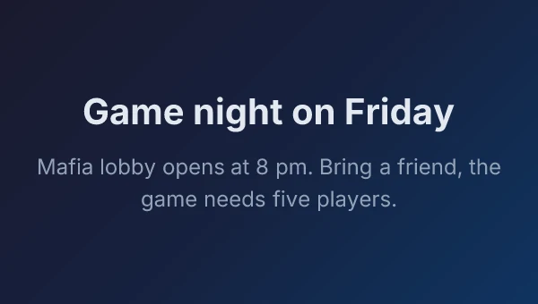

# just-a-bot

A personal Discord bot for one server: play-money casino games, party games in threads, a shared text RPG, a quote book, reminders, and a jukebox for the owner's own music library.

<p align="center">
  
</p>

**Status:** Hobby project. It runs as a container on the owner's server, last deployed on 2026-10-07 with its state started fresh. The Jukebox is built but not yet deployed or heard in Discord. Its slash commands are registered to a single server, and there is no public invite.

## What it does

- Gives every member a wallet of play coins to bet on slots, blackjack and dice, against the bot or against each other.
- Runs party games: Wordle and Hangman in their own threads, trivia from the Open Trivia Database, tic-tac-toe, Connect Four, and Mafia with night actions sent by DM.
- Keeps one RPG world per server that everyone shares. Members explore, fight, loot, trade and level up, and a town crier announces what happened.
- Remembers things for the server: quotes saved by link or right-click, reminders, birthdays, everyone's time zone, and an anonymous confession channel.
- Answers questions through an Ollama-hosted model, draws meme and announcement cards, and plays music from atrium, the owner's media app, in a voice channel.

The gambling coins are play money and buy nothing outside the games. The bot keeps its state in plain JSON files rather than a database, so a server's RPG world is one file that a person or an LLM can read. It does no moderation.

## Commands

Every slash command the bot registers, with the description Discord shows for it, copied from the definitions in [`bots/discord/src/commands/`](bots/discord/src/commands/). Options in brackets are optional. Each command links to its guide. In Discord, `/help` lists them too, built from the same registry.

| Command | Subcommands and options | What it does |
|---|---|---|
| [`/coins`](docs/discord/gambling/README.md) | `balance`, `add amount` | Manage your hypothetical gambling coins |
| [`/give`](docs/discord/gambling/README.md) | `user amount` | Give some of your coins to another player |
| [`/slots`](docs/discord/gambling/README.md) | `bet` | Spin the 5x5 slot machine (12 paylines) |
| [`/blackjack`](docs/discord/gambling/README.md) | `bet` | Play a hand of blackjack |
| [`/blackjack2`](docs/discord/gambling/README.md) | `opponent bet` | Play a hand of blackjack against another player (shared dealer) |
| [`/dice`](docs/discord/gambling/README.md) | `bet` | Roll 2d6 against the bot — biggest dice wins |
| [`/dice2`](docs/discord/gambling/README.md) | `opponent bet` | Challenge another player to a dice duel — biggest 2d6 takes the pot |
| [`/wordle`](docs/discord/wordle/README.md) | | Start a Wordle game in a new thread |
| [`/tictactoe`](docs/discord/tictactoe/README.md) | `[opponent]` | Play tic-tac-toe (vs bot or vs another user) |
| [`/c4`](docs/discord/connect-four/README.md) | | Play Connect Four against the bot |
| [`/c42`](docs/discord/connect-four/README.md) | `opponent` | Challenge someone to a game of Connect Four |
| [`/mafia`](docs/discord/mafia/README.md) | `start`, `join`, `start-now`, `vote target`, `status`, `cancel` | Play Mafia in a Discord thread |
| [`/hangman`](docs/discord/hangman/README.md) | `start [category]` | Play a game of Hangman in a thread |
| [`/trivia`](docs/discord/trivia/README.md) | `[category] [difficulty]` | Start a multiple-choice trivia question |
| [`/rpg`](docs/discord/rpg/README.md) | `start`, `exit`, `help` | Drop-in multiplayer RPG: explore, fight, loot, level up |
| [`/quote`](docs/discord/quotes/README.md) | `add link`, `random`, `search text`, `by user`, `list`, `remove id` | Save and recall memorable server messages |
| [Save Quote](docs/discord/quotes/README.md) | right-click a message, then Apps | A message menu entry with no description; it saves that message as a quote |
| [`/confess`](docs/discord/confessions/README.md) | `set-channel channel`, `submit text` | Anonymous confession box |
| [`/birthday`](docs/discord/reminders/README.md) | `set date`, `list`, `remove` | Set or view birthdays in this server |
| [`/remindme`](docs/discord/reminders/README.md) | `set when text`, `list`, `cancel id` | Set or manage personal reminders |
| [`/clock`](docs/discord/clock/README.md) | `set timezone`, `unset`, `show` | World clock — see what time it is for everyone |
| [`/jukebox`](docs/discord/jukebox/README.md) | `play track [next]`, `skip`, `previous`, `pause`, `resume`, `stop`, `join`, `leave`, `shuffle on`, `repeat mode`, `nowplaying`, `queue` | Play atrium's music in a voice channel |
| [`/ask`](docs/discord/ask/README.md) | `prompt [model]` | Ask an Ollama-hosted model a question |
| [`/img`](docs/discord/img/README.md) | `meme top bottom [template]`, `card title body` | Generate a PNG image |
| [`/top`](docs/discord/leaderboards/README.md) | `category` | Show the top 10 players for a category |
| `/ping` | | Replies with Pong! |
| `/help` | | Show all available commands |

## What the bot posts

Most replies are messages, some with buttons or an embed. Below is what `/coins add amount:1000` and then `/slots bet:50` answer. It comes from the real handlers, run outside Discord with a stub interaction. Discord shows the `**` as bold. The first reply is visible only to the member who asked; the second ends with a "Spin again (50)" button.

```text
Added **1,000** coins. New balance: **1,000**.

🎰 **Slots** — 5×5, 12 paylines (left/top anchored, 3+ in a row)
🍇 🔔 🍒 🍋 💎
🍊 ⭐ 🍊 🍒 🔔
🔔 🍒 🍒 🍊 ⭐
💎 💎 💎 ⭐ 💎
💎 🔔 🍇 🍇 🍒
Wager: **50** (12 lines)
**Winning lines (1):**
• Row 4: 💎💎💎 (3×) ×25 → **104**
Net: **+54** • Balance: **1,054**
```

`/img card title:Game night on Friday body:Mafia lobby opens at 8 pm...` posts this PNG, drawn in the bot's own process with satori and resvg:

<p align="center">
  
</p>

## How it works

One Node process runs the TypeScript directly with tsx; there is no build step. [`bots/discord/src/index.ts`](bots/discord/src/index.ts) has a single interaction handler. A slash command goes to its file in `commands/`, a button press goes to the feature that owns its `customId` prefix, such as `bj:` or `rpg:`, and a message in a Wordle or Hangman thread counts as a guess. Commands are thin and call a feature folder such as `gambling/`, `rpg/` or `mafia/`. Two timers run beside the handler: reminders and birthdays every 60 seconds, the RPG town crier every 20.

State is gitignored JSON under `bots/data/` and `bots/discord/data/`, read through an in-memory cache, with writes queued one at a time. The Jukebox is the only part that talks to another app. It signs in to atrium with its own account on Ward, the owner's sign-in service, and long-polls atrium for what to play. More in [docs/discord/architecture.md](docs/discord/architecture.md) and the [wiki's architecture page](corpus/wiki/architecture.md).

## Run it locally

Requires Node 22.12 or later, and a Discord application of your own: its bot token, its application id, and the id of a test server you have added it to.

```bash
npm install
npm test                    # unit tests; they never connect to Discord
npm run discord:register    # push the slash commands to your test server
npm run discord:dev         # run the bot, reloading on save
```

Before the last two, put `DISCORD_TOKEN`, `CLIENT_ID` and `GUILD_ID` in `bots/discord/.env`. [`bots/discord/.env.example`](bots/discord/.env.example) lists every variable. Use a test application, never the live bot's token. Discord sends each interaction to every running copy, so both copies answer and one fails with error 40060. The deploy copies `bots/discord/.env` to the server as it is, so on a machine that deploys, that file holds production's values.

Full setup, the optional `/ask` and Jukebox variables, and where state is kept are in [docs/common/setup.md](docs/common/setup.md) and [docs/discord/setup.md](docs/discord/setup.md).

## Project layout

| Path | What lives there |
|---|---|
| `bots/discord/` | The bot: `src/index.ts`, `commands/`, and one folder per feature |
| `shared/` | `@bots/shared`: logger, env loading, reminder parsing and storage. No discord.js |
| `docs/` | The operating manual, one guide per feature |
| `docs-site/` | The Starlight site that renders `docs/` and `corpus/` |
| `corpus/` | The project wiki: decisions, status, and the briefs behind each change |
| `infrastructure/` | Dockerfile and compose file for the production container |

## Docs

- [docs/](docs/README.md): setup, architecture, a guide per feature, and the images used here
- Docs site: <https://gandolh.ro/just-a-bot/docs/>, the same guides plus the wiki, built from `docs-site/`
- Project wiki: [corpus/](corpus/index.md) for decisions, status and the work log

## License

[MIT](LICENSE)
